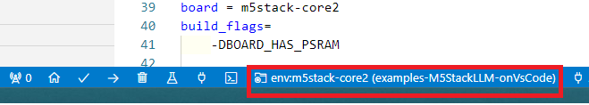

# examples-M5StackLLM-onVsCode

VsCode環境下で M5Stack LLM-Module のサンプルソフトを動かしたい方へ<br>
次のリンク先の公式examplesをVsCode環境用にすぐに試用できるようにしたものです。<br>
 https://github.com/m5stack/M5Module-LLM/tree/main/examples
<br>

---
## examples
公式examples（ソフト６本）
- KWS_ASR
- SerialTextAssistant
- TextAssistant
- TTS
- VoiceAssistant
- YOLO

 SerialTextAssistantを日本語表示できるように修正したソフトを追加しました。
- SerialTextAssistant-jp

全部で７本のソフトを用意しています。

---
## 使用方法

**動作させるソフトを"src/main.cpp"内でコメントをはずしコンパイルする**

(例) "TTS.cpp"を動作させる場合
```
// #include "../examples/KWS_ASR.cpp"<br>
// #include "../examples/SerialTextAssistant.cpp"<br>
// #include "../examples//TextAssistant.cpp"<br>
#include "../examples/TTS.cpp"<br>
// #include "../examples/VoiceAssistant.cpp"<br>
// #include "../examples/YOLO.cpp"<br>
// #include "../examples/SerialTextAssistant-jp.cpp"<br>
```
コメントに（する／はずす）だけで７本のソフトを簡単に試すことができます。

---
## 対応機種
LLM-Moduleと繋ぐM5Stack本体の機種は、次の３種に対応しています。

**M5Stack Basic**<br>
**M5Stack Core2**<br>
**M5Stack CoreS3**<br>

platformio.ini で機種ごとに対応したものを用意しています。<br>
VsCodeで下図の赤枠の付近を押すと切替えることができます。<br>


<br>
M5Stack Basic  ->  **[env:m5stack-basic]** <br>
M5Stack Core2  ->  **[env:m5stack-core2]** <br>
M5Stack CoreS3 ->  **[env:m5stack-cores3]** <br>

※ M5Stack Core2(for AWS)を使用して動作確認を実施しています。
Basic および CoreS3での確認をおこなっていませんのでご了承ください。
不具合等があった場合には、「X」にてご連絡いただければ幸いです。

---
## SD-Updater対応
M5Stack Core2(Ver1.0 and AWS) 用ですが、SD-Updater対応版にすることができます。VsCodeの下部の「Switch PlatformIO Project enviroment」で **[env:m5stack-core2-sdu]** を選択してください。

コンパイル後に ".pio/m5stack-core2-sdu"フォルダ下にfirmware.binが作成されます。名前を変えSD直下に設置すると他SD-Updater対応ソフトと切替えて使用することができます。

SD-Updater対応の他ソフトは、下記リンクから取得することができます。<br>
https://github.com/NoRi-230401/BinsPack-for-StackChan-Core2

---

